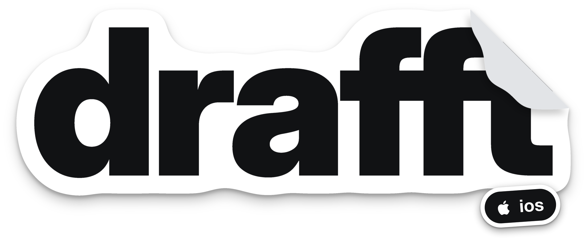
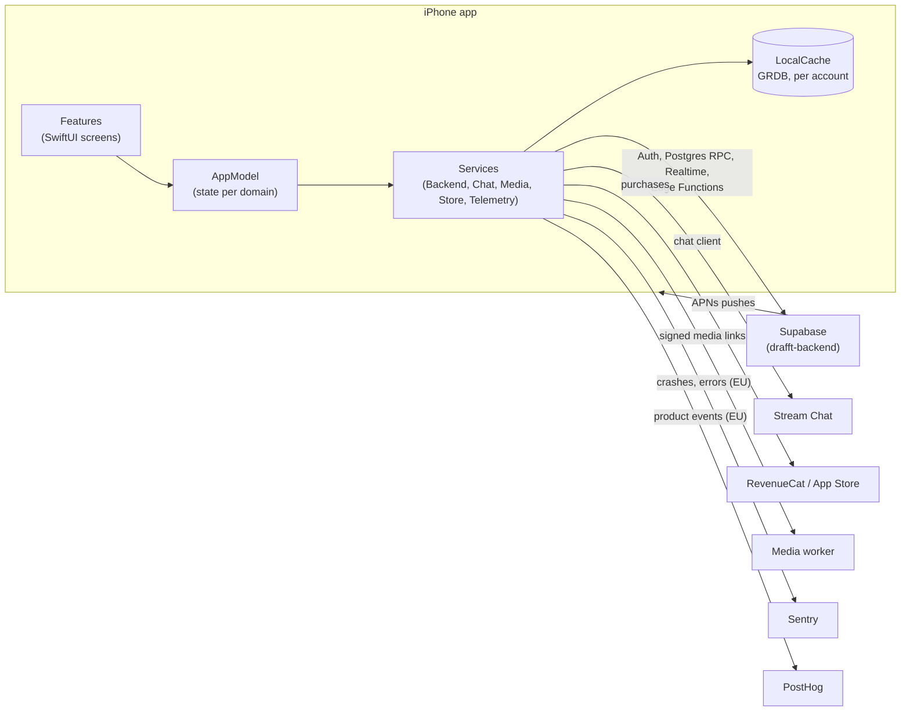

<div align="center">



# drafft for iOS

**Meet someone who gets your rhythm.**

The iPhone app of drafft, the dating app for people who train.
Profiles lead with how someone moves, and a match is an invitation to propose a session together.

[](https://github.com/sylwaninn/drafft-ios/actions/workflows/app.yml)
[](https://github.com/sylwaninn/drafft-ios/actions/workflows/pr.yml)


[Product](#product) | [Architecture](#architecture) | [Getting started](#getting-started) | [Development](#development) | [Release](#release) | [Docs](#documentation)

</div>

---

## Contents

1. [Product](#product)
2. [Architecture](#architecture)
3. [Repository layout](#repository-layout)
4. [Getting started](#getting-started)
5. [Environments](#environments)
6. [Development](#development)
7. [Quality gates](#quality-gates)
8. [Release](#release)
9. [Localization](#localization)
10. [Privacy and security](#privacy-and-security)
11. [Documentation](#documentation)
12. [Related repositories](#related-repositories)
13. [License](#license)

## Product

drafft is for active urban singles, 25 to 40, who train two to five times a week. Their week already
runs on sessions, so the app starts there: sports and how often come first on a profile, and when two
people like each other, drafft invites them to propose a session (sport, day, time, a short note).
A match promises nothing on its own; the proposal is the next step, and the people decide.

| Area | What the app does |
|---|---|
| **Sign up and sign in** | Email and password, phone verification by SMS code, explicit consents recorded on the server |
| **Profile** | Photos, sports with how often, a voice intro, an icebreaker others can react to |
| **Discover** | A deck of nearby profiles filtered by sport, likes, super likes, boosts |
| **Matches and sessions** | Mutual likes, session invites with times to pick, calendar events that follow the session |
| **Chat** | Text, photos, videos, voice messages, replies and reactions, sent optimistically |
| **drafft tempo** | The paid tier (undo, see who likes you); boosts and super likes come in packs, all through the App Store |
| **Safety** | Report and block, moderation holds, selfie check when moderation asks, support form |

Product principles, users and constraints: [PRODUCT.md](PRODUCT.md). Visual system: [DESIGN.md](DESIGN.md).
Every word people read: [WORDING.md](WORDING.md).

## Architecture

A SwiftUI app with one observable model (`AppModel`, split by domain into `AppModel+*.swift`) over a
set of services. The server is the source of truth; the app keeps a per-account cache so it opens
without the network, and a Realtime channel keeps every screen live.



| Layer | Choice | Why |
|---|---|---|
| UI | SwiftUI, iOS 26 (Liquid Glass) | Native conventions first, brand in colour, type and motion |
| Language | Swift 6, strict concurrency | Data races caught at compile time |
| Project | [XcodeGen](https://github.com/yonaskolb/XcodeGen) (`project.yml`) | The Xcode project is generated, reviewed as YAML |
| Backend | [supabase-swift](https://github.com/supabase/supabase-swift) | Auth, database, Realtime, Edge Functions |
| Chat | [Stream Chat](https://github.com/GetStream/stream-chat-swift) (low-level client) | Offline store and delivery; every screen is drafft's own |
| Purchases | [RevenueCat](https://github.com/RevenueCat/purchases-ios) | Subscriptions and packs, synced to the backend by webhook |
| Images | [Nuke](https://github.com/kean/Nuke), ThumbHash | Decoding at display size, previews while photos load |
| Cache | [GRDB](https://github.com/groue/GRDB.swift) | SQLite cache of the last known state, excluded from backups |
| Phone numbers | [PhoneNumberKit](https://github.com/marmelroy/PhoneNumberKit) | Parsing and validation for every country |
| Telemetry | [Sentry](https://github.com/getsentry/sentry-cocoa), [PostHog](https://github.com/PostHog/posthog-ios) | EU regions only, behind a `PrivacyGuard` |

Dependencies are pinned in `project.yml` (exact versions, with the reason next to each one); the
resolved graph is in `Drafft.xcodeproj/project.xcworkspace/xcshareddata/swiftpm/Package.resolved`.

## Repository layout

```text
drafft-ios/
├── Drafft/
│   ├── App/              entry point and root view
│   ├── DesignSystem/     tokens, components, icons (DESIGN.md in code)
│   ├── Features/         screens by area: Auth, Discover, Matches, Chat, Profile, Me, Verification
│   ├── Models/           value types: sports, filters, languages
│   ├── Services/         AppModel and its domains, Backend, Chat, Media, Cache, Telemetry
│   └── Resources/        assets, fonts, Localizable.xcstrings, InfoPlist.xcstrings
├── DrafftTests/          unit tests (pure logic, no network)
├── Config/               one .xcconfig per environment (public keys only)
├── StoreKit/             local StoreKit configuration for the Simulator
├── scripts/
│   ├── ci/               design and i18n lints, pull request checks, release
│   ├── icons/            icon generator (SVG to symbol sets)
│   └── local-backend.sh  points Drafft Local at a local Supabase
├── docs/                 telemetry, wording research, store screenshots
├── project.yml           XcodeGen source of the Xcode project
├── PRODUCT.md            product brief
├── DESIGN.md             design system
├── WORDING.md            voice, lexicon, forbidden wording (canonical copy)
└── AGENTS.md             rules for coding agents
```

## Getting started

### Prerequisites

| Tool | Version | Install |
|---|---|---|
| macOS and Xcode | Xcode 26 (iOS 26 SDK) | App Store |
| XcodeGen | latest | `brew install xcodegen` |
| SwiftLint | 0.65.1 (the baseline's version) | `brew install swiftlint` |
| Python | 3.10+ | ships with the Xcode command line tools |
| Supabase CLI and Docker | latest | `brew install supabase/tap/supabase`, for the local backend |

### First run

```sh
# 1. Clone next to drafft-backend (the local backend script looks for ../drafft-backend)
git clone git@github.com:sylwaninn/drafft-ios.git
cd drafft-ios
git config core.hooksPath .agents/git-hooks   # commit message and push rules

# 2. Start the backend and point the app at it
(cd ../drafft-backend && supabase start)
scripts/local-backend.sh            # Simulator; add --device for an iPhone on the same Wi-Fi

# 3. Generate the project and open it
xcodegen generate
open Drafft.xcodeproj               # scheme "Drafft Local", then Run
```

`scripts/local-backend.sh` writes the machine's Supabase URL and publishable key to
`Local.private.xcconfig` (gitignored). Without it the app stops at launch and says what is missing.

> [!IMPORTANT]
> Build and run on **Drafft Local** for day-to-day work. Every scheme shares the bundle id
> `so.drafft.app`, so installing another one replaces the local app and sends real actions
> (sign-ups, likes, messages) to staging or production.

## Environments

| Scheme | Configuration | Backend | Home screen name | Telemetry |
|---|---|---|---|---|
| **Drafft Local** | `Local` | Supabase on your Mac, staging services | drafft local | off |
| **Drafft Staging** | `Staging` | Supabase branch `staging` | drafft β | on, `environment: staging` |
| **Drafft** | `Release` | production | drafft | on, `environment: production` |

Each configuration reads `Config/<Name>.xcconfig`. Those files hold public client keys only
(Supabase publishable key, RevenueCat public SDK key, Sentry DSN, PostHog project key, Turnstile site
key): row-level security and the server's own secrets do the rest. CI refuses anything shaped like a
secret there.

## Development

### Branches

| Branch | Role | Moves through |
|---|---|---|
| `staging` | default branch, integration | squash-merged pull requests only |
| `main` | production | the release workflow only |
| `feat/*`, `fix/*`, `chore/*`, `docs/*`, `refactor/*` | work | your pushes |

Both `staging` and `main` are protected, and the `pre-push` hook refuses direct pushes to them.

### Commits

One line, [Conventional Commits](https://www.conventionalcommits.org/), lowercase, no final period, no body,
no trailers:

```text
feat(mobile): show likes as a banner over an equal blurred grid
fix(mobile): keep button labels on one line in every language
```

Types: `feat`, `fix`, `docs`, `style`, `refactor`, `test`, `chore` (`type!:` for a breaking change).
The `commit-msg` hook enforces it.

### Signed commits

Sign every commit with an SSH key registered on GitHub as a signing key, so each one shows as
**Verified**:

```sh
git config --global gpg.format ssh
git config --global user.signingkey ~/.ssh/id_ed25519.pub
git config --global commit.gpgsign true
git config --global tag.gpgsign true
```

Squash merges made on GitHub are signed by GitHub and keep you as the author.

### Pull requests

1. Branch from `staging`, commit, push, open a pull request **into `staging`**.
2. The title follows the commit format: it becomes the squash commit.
3. Fill in the [template](.github/pull_request_template.md): summary, changes, testing, and the notes on
   telemetry, wording, privacy and companion pull requests.
4. Run the checks below before asking for a merge. Squash and merge, then delete the branch.

### Verify locally

```sh
xcodegen generate && xcodebuild -project Drafft.xcodeproj -scheme Drafft \
  -destination 'generic/platform=iOS Simulator' build
swiftlint lint --strict --baseline .swiftlint-baseline.json
python3 scripts/ci/design_lint.py && python3 scripts/ci/i18n_lint.py
```

Unit tests run from Xcode (`⌘U`) on the Drafft Local scheme.

## Quality gates

Every pull request runs two workflows on Linux runners. Building, testing and archiving belong to
Xcode, which has the toolchain and the signing.

| Workflow | Job | Checks |
|---|---|---|
| [`app.yml`](.github/workflows/app.yml) | swift | SwiftLint, strict, new violations only (debt in `.swiftlint-baseline.json`) |
| | design | DESIGN.md rules: palette colours only, no gradient but photo scrims, a surface on every sheet, lowercase brand |
| | i18n | 7 languages complete, matching placeholders, catalog in sync with the code, WORDING.md's forbidden patterns |
| | hygiene | gitleaks over the whole history, actionlint, media files under 1 MB, public keys only, telemetry in the EU |
| [`pr.yml`](.github/workflows/pr.yml) | pr | base is not `main`, title format, description filled in, commit authors, no attribution trailer, signatures |

A deliberate exception to a design rule carries its reason in the code:
`// design-lint: allow <rule> - <why>`.

## Release

`main` is production and moves only through **Actions > release > Run workflow**
([`release.yml`](.github/workflows/release.yml), [`scripts/ci/release.sh`](scripts/ci/release.sh)):

1. `staging`'s head must have a green `app.yml` push run.
2. `main` fast-forwards to it (it never holds a commit `staging` lacks).
3. The commit gets the next `vX.Y.Z` tag and a GitHub release listing its pull requests.
   `auto` reads the titles: `type!:` gives a major, any `feat` a minor, anything else a patch.

Store builds are archived by hand from the release tag. Before an archive, the Sentry upload token
must be set so the dSYMs upload ([docs/telemetry.md](docs/telemetry.md#readable-stack-traces-dsyms)).

## Localization

English (source), French, Spanish, German, Italian, European Portuguese and Dutch. People pick the
language in the app, not from the phone. Strings live in `Drafft/Resources/Localizable.xcstrings`; text
built in code goes through `L("…")`. Any user-facing change starts with [WORDING.md](WORDING.md) and
ends with its review checklist (section 10).

## Privacy and security

- **Data on the phone:** the session in the Keychain, one SQLite cache per account (excluded from
  backups), the chat's offline copy. Signing out or deleting the account removes them. The exact
  location never leaves the phone: it is blurred to a cell of about 1 km first.
- **Telemetry:** Sentry and PostHog in their EU regions only, no screenshots, replay or autocapture.
  `PrivacyGuard` drops free text, sensitive answers, locations and other people's ids, and unit tests fail
  on them. Details and the event catalogue: [docs/telemetry.md](docs/telemetry.md).
- **Secrets:** none in this repository. Only public client keys live in `Config/`, allowlisted by value
  in [`.gitleaks.toml`](.gitleaks.toml). Server secrets stay in drafft-backend's environments.
- **Privacy manifest:** [`Drafft/PrivacyInfo.xcprivacy`](Drafft/PrivacyInfo.xcprivacy), updated with any
  new data type or required-reason API.
- **Reporting a vulnerability:** write privately to the maintainer through GitHub's
  [security advisories](https://github.com/sylwaninn/drafft-ios/security/advisories/new). No public issue.

## Documentation

| Document | Read it when you |
|---|---|
| [PRODUCT.md](PRODUCT.md) | need the users, the principles, the privacy and legal rules |
| [DESIGN.md](DESIGN.md) | touch anything on screen |
| [WORDING.md](WORDING.md) | write any text people read, in any language |
| [docs/telemetry.md](docs/telemetry.md) | add an event, a screen, an error or an alert |
| [docs/store-screenshots/README.md](docs/store-screenshots/README.md) | produce App Store screenshots |
| [scripts/icons/README.md](scripts/icons/README.md) | add or change an icon |
| [AGENTS.md](AGENTS.md) | run a coding agent on this repository |

## Related repositories

| Repository | Role |
|---|---|
| `drafft-backend` | Supabase schema, Edge Functions, pushes, moderation, data retention |
| `drafft-android` | the Android app, same events, wording and design rules |
| `drafft-web` | getdrafft.com, the legal pages the app opens |
| `drafft-sophros` | the back office: moderation, support, account actions |

## License

Proprietary. Copyright © 2026 the drafft authors. All rights reserved. No permission is granted to use, copy,
modify or distribute this code without written consent.
