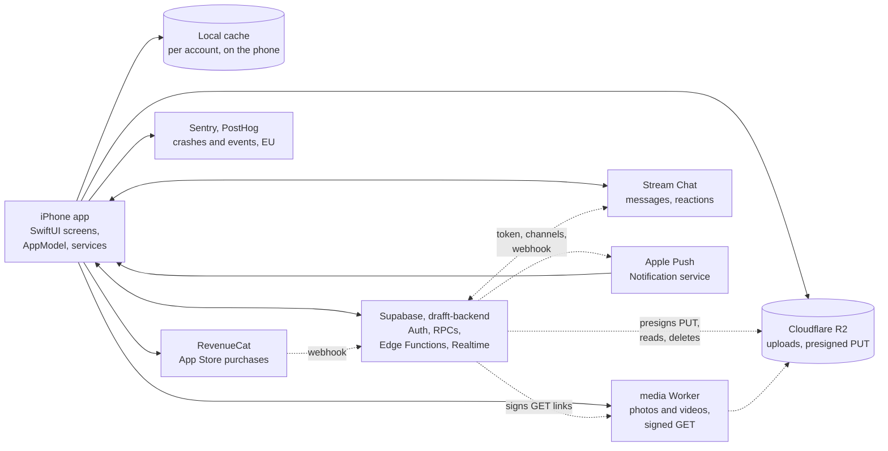

<div align="center">


**Meet someone who gets your rhythm.**

The iPhone app of drafft, the dating app for people who train.

[](https://github.com/sylwaninn/drafft-ios/actions/workflows/app.yml)
[](https://github.com/sylwaninn/drafft-ios/actions/workflows/pr.yml)


[Product](#product) | [How it works](#how-it-works) | [Getting started](#getting-started) | [Release](#release) | [Docs](#documentation)

</div>

## Product

drafft is the dating app for people who train. Sports come first on a profile, and when two people like each
other, drafft invites them to propose a session. A match promises nothing on its own: the proposal is the next
step, and the people decide.

| Area | What the app does |
|---|---|
| **Sign up** | Email and password, phone check by SMS code, consents recorded on the server |
| **Profile** | Photos, sports with how often, a voice intro, an icebreaker others can react to |
| **Discover** | Nearby profiles filtered by sport, likes, super likes, boosts |
| **Matches and sessions** | Mutual likes, session invites, calendar events |
| **Chat** | Text, photos, videos, voice messages, replies and reactions |
| **drafft tempo** | The paid tier (undo, see who likes you); boosts and super likes in packs |
| **Safety** | Report and block, moderation, selfie check, help center |

## How it works

A native iPhone app on the drafft backend. The server is the source of truth: the app shows what it last knew
at once, then reads the server again and listens to the account's Realtime channel, so every screen stays live.



### The app

- **Start.** `DrafftApp` starts telemetry, diagnostics (MetricKit), the image pipeline and RevenueCat, then
  `RootView` shows welcome, sign-up or the five tabs (Discover, Likes, Sessions, Chats, You). The tabs are built
  once, ahead of time, out of sight.
- **State.** One `@MainActor @Observable` `AppModel`, split by domain into `AppModel+*.swift` files, passed to
  every screen through the environment. The account hold and the location request each cover the app in their
  own window.
- **Folders.** `Drafft/App` (entry), `Features/` (screens by area), `DesignSystem/` (DESIGN.md in code),
  `Services/` (model and services), `Models/` (value types), `Resources/` (catalogs, fonts, assets).

### Backend link

- **Client.** supabase-swift for Auth (the session in the Keychain), Realtime and Storage (the selfie upload);
  RPCs, table reads and Edge Functions are plain `URLSession` calls made as the signed-in person.
- **Errors.** The backend answers a stable code (`hint` for database functions, `code` for Edge Functions);
  `ServerMessage` turns it into words, never the raw reply. `moderated` reads the account again (a hold covers
  the app); `paused` locks Discover.
- **Edge Functions called.** `media-upload-url`, `stream-token`, `chat-media`, `phone-code`, `purchase-sync`,
  `delete-account`, `device-check` (DeviceCheck token, at launch and sign-in), `support` (Turnstile when signed
  out), `app-config`.

### Live updates

The app joins the private Realtime topic `user:<id>`. A failed join is retried with a growing pause, and a
channel that stays down is rebuilt (`UserChannel`).

| Event | What the app does |
|---|---|
| `like`, `match`, `match_ended` | reads likes or matches again, closes an ended match |
| `session` | updates the session, its chat card and its calendar event |
| `media` | applies a photo's moderation verdict |
| `wallet` | reads the balance (boosts, super likes, drafft tempo) and the likes again |
| `profile`, `moderation` | reads the account again (the deck too when preferences changed); a hold covers the app |
| `session_revoked` | signs out if this device's session ended elsewhere |

On each join and each return to the foreground, it also reads the account, the wallet and sessions again,
re-checks photos waiting for a verdict, reads Discover again when what it shows has grown old
(`DiscoveryFreshness`), and resumes any purchase still being credited.

### Media

- **Upload.** `media-upload-url` returns a ticket, then the file goes straight to Cloudflare R2 with a presigned
  PUT from a background `URLSession` (two retries; a new ticket on 403). Photos are at most 2048 px on the long
  edge, stripped of EXIF and GPS, and get a ThumbHash; videos are re-encoded to HEVC 720p.
- **Profile photos.** A picked photo is a draft (`add_profile_media`), checked by the backend; its verdict
  arrives as a `media` event. Save publishes the set (`save_profile_media`); unsaved drafts are deleted.
- **Display.** Cards carry signed links of about an hour. drafft's loader in front of Nuke renews a link about
  to expire through `media_urls` and asks the media Worker for the width a photo is drawn at (`&w=`, the
  steps in `Renditions.swift`). Nuke decodes at frame size and shows the ThumbHash meanwhile. Memory and disk
  caches are keyed by photo and width, never by signature; fewer downloads run at once on a slow or constrained
  network (sizes and limits in `Images.swift`).
- **Chat media.** Photos and videos sent in a chat are delivered first, then checked silently (`chat-media`).
- **Blurred likes.** Without drafft tempo, Likes shows a ThumbHash, then a blurred copy made by the server.
- **Selfie check**, only when moderation asks: the front camera with Vision face detection, the photo goes to
  the backend's `verification-selfies` storage, then `submit_selfie`.

### Chat

Stream Chat's low-level client, every screen drafft's own, with Stream's offline store. `stream-token` gives the
token (asked again whenever Stream needs one). One `messaging` channel per match, named by the match id; the
list shows the person's channels that aren't frozen. Photos, videos and voice messages are attachments that
carry a media key, never a link. Session cards, super like notes and replies to an icebreaker or a photo
come from the backend as messages. Texts written offline wait for the connection.

### Push notifications

- **Tokens.** The APNs token is registered with the backend (`register_push_token`, with the build's sandbox or
  production environment) and with Stream (push provider `drafft-apn`, or `drafft-apn-dev` in the sandbox).
- **Senders.** The backend pushes likes, matches, sessions and reminders, photo refusals, account notices and
  the weekly boost; Stream pushes chat messages. While the app is open, a message from another chat shows as a
  local notification, a photo refusal shows drafft's own banner instead of the system's, and an account notice
  shows nothing (the screen already changed live).
- **Taps.** One reading of every payload (`PushRoute`, unit-tested): a message, a reaction, a match, a session
  update or reminder opens the chat; a like or a super like opens Likes; a session cancelled because its match ended
  opens Sessions, as a reminder with no chat does; the weekly boost and account notices open Discover; a kind
  this build doesn't know opens its chat or tab if it names one, else Discover; a refused photo shows why. The
  tap is kept (`NotificationService.pendingRoute`) until the tabs are on screen, signed in
  and past the launch (a tap that launched the app arrives before any of it), then followed by
  `AppModel.follow`: open sheets and covers close, and a chat not read yet waits for the matches (one fresh
  read for a match just made), else the chat list shows. A tap waiting over ten minutes (a sign-in), replaced by a newer tap or left from another account is dropped.
  Notification settings (`notify_*`) are saved on the profile, which the backend reads before sending.

### Purchases

RevenueCat on the App Store, logged in with the Supabase user id. Offerings: the current one (`default`, drafft
tempo), `boosts`, `super_likes`; entitlement `drafft_tempo`. Once the App Store confirms, `purchase-sync` asks the
server to credit the purchase (RevenueCat's webhook does too) and returns the new balance. The app keeps the
purchase pending for the account and asks again, with a growing pause, until the server reports it credited.
Nothing is credited on the phone. The **Drafft** scheme runs with a local StoreKit configuration
(`StoreKit/Drafft.storekit`).

### Location and calendar

- **Location.** Reduced accuracy, while in use, required to use the app. A reading is blurred to the centre of a
  cell of about 1 km before `set_location` or `area_at`. Outside France or offline, the app names the area
  itself.
- **Calendar.** "Add to calendar" adds a session as an event. With full calendar access the event follows the
  session (moved, removed when cancelled), never overwriting what the person edited; with add-only access it is
  added and left as is.

### Telemetry

- **Sentry** (EU only): crashes, hangs, MetricKit, unexpected errors and sampled traces. No screenshots, view
  hierarchy, replay, personal data or IP.
- **PostHog** (EU only): the app's own events and screens, plus PostHog's app lifecycle events; no autocapture or
  replay. Events stay anonymous until the person grants analytics consent, and stop if they refuse.
- **PrivacyGuard** drops what people typed, sensitive answers, locations and other people's ids before anything
  leaves the phone. Events and rules: [docs/telemetry.md](docs/telemetry.md).

### On the phone

- **Cache.** `LocalCache` (GRDB): one SQLite file per account, excluded from backups: profile, matches, likes
  (with drafft tempo) and the Discover deck (while recent and under the same filters, `DeckCache`). Shown first,
  then replaced by the server's answer. Erased at sign-out and account deletion.
- **Stream's offline store** for chats; Nuke's disk cache for images.

### Built with

| Layer | Choice |
|---|---|
| UI | SwiftUI, iOS 26 (Liquid Glass), iPhone only |
| Language, project | Swift 6 with strict concurrency; [XcodeGen](https://github.com/yonaskolb/XcodeGen) (`project.yml`) |
| Backend | [supabase-swift](https://github.com/supabase/supabase-swift) |
| Chat | [Stream Chat](https://github.com/GetStream/stream-chat-swift), low-level client |
| Purchases | [RevenueCat](https://github.com/RevenueCat/purchases-ios) |
| Images, cache | [Nuke](https://github.com/kean/Nuke), ThumbHash; [GRDB](https://github.com/groue/GRDB.swift) |
| Phone numbers | [PhoneNumberKit](https://github.com/marmelroy/PhoneNumberKit) |
| Telemetry | [Sentry](https://github.com/getsentry/sentry-cocoa), [PostHog](https://github.com/PostHog/posthog-ios) |

Dependencies are declared in `project.yml` (most pinned to an exact version, with the reason); the resolved
versions are in `Drafft.xcodeproj/project.xcworkspace/xcshareddata/swiftpm/Package.resolved`.

## Getting started

Needs Xcode 26, `brew install xcodegen swiftlint`, and Python 3 for the lints.

```sh
git clone git@github.com:sylwaninn/drafft-ios.git      # next to drafft-backend
cd drafft-ios && git config core.hooksPath .agents/git-hooks

xcodegen generate && open Drafft.xcodeproj             # scheme "Drafft Staging", then Run
```

> [!IMPORTANT]
> Work on **Drafft Staging**. Every scheme shares the bundle id `so.drafft.app`: installing another one replaces
> the staging app and sends real actions to production.

| Scheme | Backend | Home screen name | Telemetry |
|---|---|---|---|
| **Drafft Staging** | Supabase branch `staging` | drafft β | `staging` |
| **Drafft** | production | drafft | `production` |

The two schemes read `Config/Staging.xcconfig` and `Production.xcconfig`. Branches, commits, checks
and pull requests: [CONTRIBUTING.md](CONTRIBUTING.md).

## Release

`main` is production and moves only through **Actions > release**: with `staging` green, it fast-forwards
`main`, tags the next `vX.Y.Z` from the pull request titles and publishes a GitHub release. Store builds are
archived by hand from the tag; with `sentry-cli` and its upload token set, the archive uploads its dSYMs
([docs/telemetry.md](docs/telemetry.md#readable-stack-traces-dsyms)).

## Localization

English (source), French, Spanish, German, Italian, European Portuguese and Dutch, picked in the app, not from
the phone. Strings live in `Drafft/Resources/Localizable.xcstrings`, the catalog both drafft apps share; text
built in code goes through `L("…")`. Any change to what people read starts with [WORDING.md](WORDING.md).

## Security

No secret in this repository: `Config/` holds public client keys only, allowlisted by value in
[`.gitleaks.toml`](.gitleaks.toml), and CI refuses anything shaped like a secret. The privacy manifest is [`Drafft/PrivacyInfo.xcprivacy`](Drafft/PrivacyInfo.xcprivacy).
Report a vulnerability privately through
[security advisories](https://github.com/sylwaninn/drafft-ios/security/advisories/new), never in an issue.

## Documentation

| Document | Read it when you |
|---|---|
| [PRODUCT.md](PRODUCT.md) | need the users, the principles, the privacy and legal rules |
| [DESIGN.md](DESIGN.md) | touch anything on screen |
| [WORDING.md](WORDING.md) | write any text people read, in any language |
| [CONTRIBUTING.md](CONTRIBUTING.md) | open a pull request: branches, commits, signing, checks |
| [docs/telemetry.md](docs/telemetry.md) | add an event, a screen, an error or an alert |
| [docs/store-screenshots](docs/store-screenshots/README.md) | produce App Store screenshots |
| [scripts/icons](scripts/icons/README.md) | add or change an icon |
| [AGENTS.md](AGENTS.md) | run a coding agent on this repository |

## Related repositories

| Repository | Role |
|---|---|
| [drafft-android](https://github.com/sylwaninn/drafft-android) | Android app |
| [drafft-backend](https://github.com/sylwaninn/drafft-backend) | Supabase, Edge Functions, media and support Workers |
| [drafft-web](https://github.com/sylwaninn/drafft-web) | getdrafft.com and the legal pages the app opens |
| [drafft-sophros](https://github.com/sylwaninn/drafft-sophros) | moderation and support dashboard |

## License

Proprietary. Copyright © 2026 the drafft authors. All rights reserved. No permission is granted to use, copy,
modify or distribute this code without written consent.
